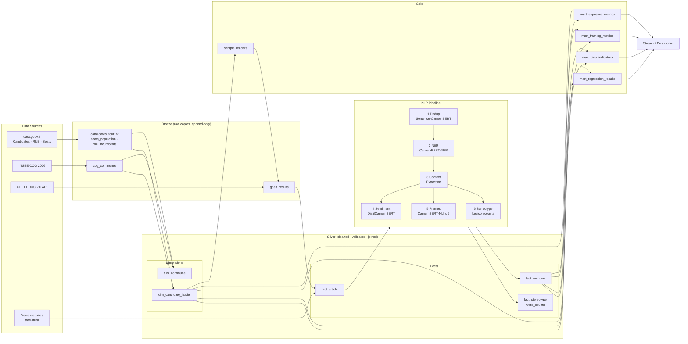
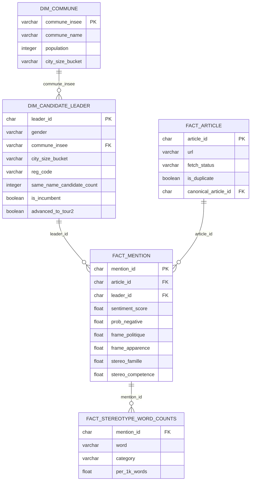

# French Municipal Elections 2026 - Gender Bias in Media Coverage

A data analysis portfolio project examining whether French media coverage of the
2026 municipal elections (*elections municipales*) shows systematic
differences in how male and female candidates are reported on.

---

## Research Questions

- Do French news outlets cover male and female list leaders at different rates during the 2026 municipal election cycle?
- When coverage does exist, does the framing and tone differ by candidate gender?
- Are observed differences associated with factors such as city size, political affiliation, or incumbent status?

---

## Context

France held its municipal elections on **15 and 22 March 2026**. With over
900,000 candidates across more than 50,000 lists, these elections are one of
the largest democratic exercises in the country. Since 2026, all communes -
including those under 1,000 inhabitants - use party-list balloting with strict
gender alternation rules, making this a particularly relevant cycle for
studying gender representation in both politics and media.

This project focuses on **list leaders** (*tetes de liste*) as the unit of
analysis, keeping the scope tractable while capturing the candidates most
likely to receive media attention.

---

## Analysis Scope

| Dimension | Detail |
|---|---|
| Analysis window | 1 February - 30 April 2026 |
| Candidates | 24 list leaders, balanced 50/50 male/female |
| Sampling | Matched stratified cohort: `large=4`, `medium=8`, `small=12`, with a 50/50 gender split inside each stratum |
| Language | French-language sources |
| Geography | France (metropolitan and overseas) |

The sample is intentionally small and stratified rather than exhaustive, to
allow for deeper per-candidate analysis while remaining reproducible and
auditable.

---

## Methodology

The analysis cohort is constructed through **matched stratified sampling**
rather than equal allocation across city sizes. The `4 / 8 / 12` quota design
is intentional: it preserves gender balance within each city-size stratum while
reducing the risk that metropolitan candidates dominate the final media corpus.
This matters because large communes are a small share of the municipal map,
women list leaders are scarcer in the largest communes, and larger urban races
are likely to generate more press volume per sampled candidate.

The resulting cohort is therefore designed for **matched comparison**, not for
equal-precision estimation within each stratum. Its goal is to keep gender
comparisons interpretable after controlling for city size, while remaining
auditable through a materialized cohort table and a run-level sample manifest.

---

## Data Sources

All primary data comes from official French public open data, used under their
respective open licences. Sources include:

- **Candidate and list data** - French Interior Ministry (*Ministere de l'Interieur*) via [data.gouv.fr](https://www.data.gouv.fr), covering first-round candidate lists for the 2026 municipal elections. Data may be updated following legal challenges or corrections; version metadata is tracked.
- **Geographic reference data** - INSEE Code Officiel Geographique (COG) 2026, providing commune/departement/region codes and labels used as join keys.
- **Seat and population data** - Interior Ministry dataset on council seat counts and population figures per commune, used for normalising exposure metrics.
- **Incumbent labels** - Interior Ministry RNE (*Repertoire National des Elus*) data on current mayors and councillors, used to flag incumbent candidates.
- **News data** - French-language news articles covering the election period, collected in compliance with applicable access rules and data minimisation principles. Only derived features and limited contextual excerpts are retained; full article text is not stored or published.

---

## Key Metrics (planned)

The analysis is organised around three layers:

1. **Exposure** - article counts, headline mentions, and number of distinct media sources per candidate, normalised by commune population.
2. **Tone and framing** - sentiment signals and topical frame distribution (for example policy/governance vs. appearance/private life) for sentences associated with each candidate.
3. **Bias indicators** - gender-level comparisons of framing distributions and stereotype-associated vocabulary frequency, with regression models controlling for city size, political bloc, incumbent status, and region.

---

## Ethical and Legal Notes

- All official datasets are published under open licences; sources and version timestamps are recorded.
- News article collection follows the principle of **data minimisation**: only fields required for the analysis are retained.
- No full article texts are stored, redistributed, or displayed publicly.
- French TDM (text and data mining) rules and CNIL recommendations are respected.

---

## Status

> **In progress.** Bronze official-data ingest, Silver dimension tables, and the Gold sampling cohort are implemented. NLP processing and the downstream analytical marts remain forthcoming.

---

## Pipeline Architecture

This project uses the **medallion architecture** (Bronze -> Silver -> Gold),
the standard pattern in modern data engineering (Databricks, dbt, Snowflake).

| Layer | Purpose | Key Tables |
|---|---|---|
| **Bronze** | Faithful raw copies, append-only | `gdelt_results`, `candidates_tour1/2`, `cog_communes`, `seats_population`, `rne_incumbents` |
| **Silver** | Cleaned, validated, analysis-ready | `dim_commune`, `dim_candidate_leader`, `fact_article`, `fact_mention`, `fact_stereotype_word_counts` |
| **Gold** | Cohort snapshot + aggregated metrics for dashboard | `sample_leaders`, `mart_exposure_metrics`, `mart_framing_metrics`, `mart_bias_indicators`, `mart_regression_results` |
| **Meta** | Pipeline observability | `meta_run`, `meta_source_snapshot` |

The central fact table is **`fact_mention`** (grain: one article x one
candidate). All NLP outputs - sentiment scores, frame classifications,
stereotype word counts - are anchored to this grain.

Full logical data model: [`docs/data-model.md`](docs/data-model.md)

### End-to-End Pipeline



**Current implementation note.** The runnable pipeline implemented in this repo
currently stops at `gold.sample_leaders` plus `sample_manifest.json`. The GDELT,
NLP, and mart path shown here remains the planned full architecture; later
article collection is intended to be scoped to the sampled cohort.

### Silver Layer - Entity Relationships



---

## Project Structure

```text
election-gender-bias_D4W/
  README.md
  docs/               # Project documentation (data model, architecture)
  data/               # Data files (not committed to git)
  scripts/            # Runnable entry points
  src/                # Source code
  tests/              # Tests
```

---

## Motivation

This project is being developed as a portfolio piece demonstrating end-to-end
data work: from ingesting and modelling structured official data, to
collecting and analysing unstructured text, to producing interpretable
quantitative findings. The 2026 municipal elections provide a timely,
well-defined, and publicly documented empirical setting.
