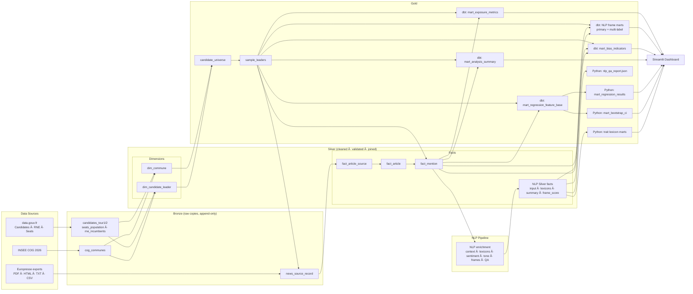
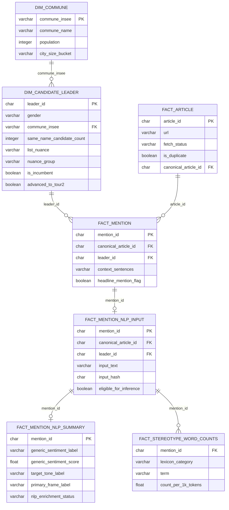

# French Municipal Elections 2026 - Gender Bias in Media Coverage

> Last updated: 2026-05-27

A data analysis portfolio project examining whether French media coverage of the
2026 municipal elections (*elections municipales*) shows systematic
differences in how male and female candidates are reported on.

---

## Research Questions

- Do French news outlets cover male and female list leaders at different rates during the 2026 municipal election cycle?
- When coverage does exist, does the framing and tone differ by candidate gender?
- Are observed differences associated with factors such as city size, political affiliation, or incumbent status?

---

## Context

France held its municipal elections on **15 and 22 March 2026**. With over
900,000 candidates across more than 50,000 lists, these elections are one of
the largest democratic exercises in the country. Since 2026, all communes -
including those under 1,000 inhabitants - use party-list balloting with strict
gender alternation rules, making this a particularly relevant cycle for
studying gender representation in both politics and media.

This project focuses on **list leaders** (*tetes de liste*) as the unit of
analysis, keeping the scope tractable while capturing the candidates most
likely to receive media attention.

---

## Analysis Scope

| Dimension | Detail |
|---|---|
| Analysis window | 1 November 2025 - 30 April 2026 |
| Candidates | 36 electorally viable list leaders, balanced 50/50 male/female |
| Sampling | Stratified sampling with gender quota: `large=6`, `medium=12`, `small=18`, with a 50/50 gender split inside each stratum, `max 1 candidate per commune`, and a round-1 viability filter |
| Language | French-language sources |
| Geography | Metropolitan France only |

The sample is intentionally small and stratified rather than exhaustive, to
allow for deeper per-candidate analysis while remaining reproducible and
auditable.

---

## Methodology

The analysis cohort is constructed through **stratified sampling with a gender
quota** rather than equal allocation across city sizes. The `6 / 12 / 18` quota
design is intentional: it preserves gender balance within each city-size
stratum while reducing the risk that metropolitan candidates dominate the final
media corpus. This matters because large communes are a small share of the
municipal map, women list leaders are scarcer in the largest communes, and
larger urban races are likely to generate more press volume per sampled
candidate.

The resulting cohort is designed for controlled descriptive comparison, not
1:1 statistical matching or equal-precision estimation within each stratum. Its
goal is to keep gender comparisons interpretable after accounting for city
size, while remaining auditable through a materialized cohort table and a
run-level sample manifest.

The primary cohort is limited to **electorally viable candidates**. A leader is
eligible when they either:

- win at least `10%` of expressed votes in round 1, or
- finish in the top `2` lists within their commune in round 1

That viability filter reflects the study's substantive target: candidates who
were plausibly part of the local media agenda. Within that viable-candidate
frame, the final 36-person cohort is still sampled reproducibly under the
stratified `6 / 12 / 18` city-size design.

The current cohort also applies a hard regional concentration cap: no more
than `4` candidates may come from the same region. Region diversity still acts
as an adaptive tie-break inside that cap, so the sample stays geographically
legible without overconcentrating in ÃŽle-de-France or any other single region.

---

## Data Sources

All primary data comes from official French public open data, used under their
respective open licences. Sources include:

- **Candidate and list data** - French Interior Ministry (*Ministere de l'Interieur*) via [data.gouv.fr](https://www.data.gouv.fr), covering first-round candidate lists for the 2026 municipal elections. Data may be updated following legal challenges or corrections; version metadata is tracked.
- **Official municipal results** - French Interior Ministry round 1 and round 2 commune-level result exports from [data.gouv.fr](https://www.data.gouv.fr), normalized into one leader x commune x round and used to derive vote-share covariates.
- **Geographic reference data** - INSEE Code Officiel Geographique (COG) 2026, providing commune/departement/region codes and labels used as join keys.
- **Seat and population data** - Interior Ministry dataset on council seat counts and population figures per commune, used for normalising exposure metrics.
- **Incumbent labels** - Interior Ministry RNE (*Repertoire National des Elus*) data on current mayors and councillors, used to flag incumbent candidates.
- **News data** - French-language election coverage exported from Europresse during the analysis window. The ETL uses full text transiently for parsing and candidate matching, but persisted repository artifacts keep only derived features, hashes, lengths, and short previews rather than full article text.

---

## Key Metrics

The analysis is organised around three layers:

1. **Exposure** - article counts, headline mentions, and number of distinct media sources per candidate, normalised by commune population.
2. **Tone, framing, and traits** - a generic sentiment baseline, target-aware tone, Silver frame scoring, two-tier deterministic trait lexicon counts, tone threshold sensitivity QA, unified NLP QA reporting, backup-model agreement sampling, and dbt Gold frame distribution marts are implemented for mention contexts.
3. **Bias indicators** - gender-level comparisons of framing distributions, trait vocabulary, and stereotype-associated vocabulary frequency, with a parsimonious primary exposure model plus higher-dimensional sensitivity models.

---

## Ethical and Legal Notes

- All official datasets are published under open licences; sources and version timestamps are recorded.
- News article collection follows the principle of **data minimisation**: full text is used only transiently during the ETL run for matching and metric construction.
- Persisted Parquet and DuckDB artifacts retain hashes, lengths, derived
  features, and limited review snippets rather than full article text. QA
  context excerpts are hidden in the dashboard unless `SHOW_QA_SAMPLES=true`.
- French TDM (text and data mining) rules and CNIL recommendations are respected.

---

## Key Findings

### Data coverage

The corpus covers all 36 cohort candidates with no zero-coverage leaders.
Roughly 4.0k Europresse source records were ingested, with a very low parsing
rejection rate and approximately 3.7k canonical articles in the corpus.

### Exposure - raw article counts

Male candidates received more raw article volume on average across the analysis
window, but the mean is strongly affected by one high-coverage incumbent.

This raw gap is largely explained by two confounding factors:

- **Incumbent status.** Incumbents attract disproportionate press volume
  regardless of gender, and the high-volume incumbent composition is not
  balanced across the cohort.
- **City size.** Large communes generate higher absolute press volume by
  construction. One large-city sitting mayor accounts for approximately 1.3k
  articles, making the outlier effect visible in both the dashboard and the
  robustness tables.

Within the small-city stratum - where incumbent composition is most balanced -
the raw article counts are nearly equal at roughly 27 to 30 articles on
average.

The dashboard includes an outlier sensitivity panel that recomputes the same
gender comparison under five robust summaries: all candidates, drop top overall,
drop top each gender, cohort p95 winsorized mean, and median. This makes the
high-leverage large-city incumbent visible rather than silently averaging that
candidate into the headline number.

### Exposure - population-adjusted rate

After dividing by commune population (articles per 10,000 residents), the
direction reverses at the overall level: female candidates average roughly
**33** per 10k vs. roughly **28** for male candidates. This reversal is itself a
city-size artefact: small-commune candidates produce high per-capita rates by
construction (small denominator), and the small-city stratum is gender-balanced.

The most informative signal at this level comes from the **medium-city
stratum**, where female candidates average roughly 22 per 10k versus roughly 10
for male candidates, a 2x-plus female advantage that is not explained by incumbent
composition (5F non-incumbent vs. 5M non-incumbent in that stratum).

### Regression - robust audit

This is an observational directional audit, not a causal claim. The coefficient
below should be read as a model-based association that must be interpreted with
the diagnostics and limitations in this section.

The governed primary model is Negative Binomial with a population exposure
offset and a deliberately small control set:
`article_count ~ gender_female + is_incumbent + offset(log(population))`.
Rows with unknown incumbent status are excluded from this primary model and
reported explicitly. City-size bucket, political bloc, final-round status, and
region fixed effects remain available as sensitivity or appendix models because
the 36-candidate cohort is too small for a high-dimensional headline model.

Poisson remains visible as a diagnostic only, mainly to expose overdispersion.
Regression outputs include Benjamini-Hochberg q-values, model roles, parameter
counts, excluded missing-control counts, and a fixed-seed placebo gender-label
check. The exposure gap is best summarized as outlier-sensitive: the raw male
mean is dominated by one large-city incumbent, and the adjusted model signal
must be interpreted as an observational audit signal.

### Sentiment, framing, tone, and lexicon audit

The deterministic lexicon audit is implemented as Phase 1 of the NLP enrichment
layer. It counts versioned French vocabulary categories from mention-level
context windows only, without persisting full article text. The original
stereotype lexicon remains a sparse structural seed; the two-tier trait lexicon
adds `core` high-precision terms and `exploratory` discovery terms for
political work, leadership/competence, personality, family/private life,
appearance/body, romance/relationships, scandal/conflict, and security/order.
README-level interpretation should use the `core` tier; the `exploratory` tier
is a dashboard discovery aid and requires context review before strong claims.

The Phase 2 generic sentiment baseline is implemented in
`silver.fact_mention_nlp_summary` using the optional
`cmarkea/distilcamembert-base-sentiment` model. The model card documents
French 1-5 star labels and Amazon Reviews / Allocine training data:
https://huggingface.co/cmarkea/distilcamembert-base-sentiment. This output is
a review-domain baseline diagnostic, not candidate-aware political tone.
The dashboard exposes it in a baseline diagnostic expander only.

Phase 3 target-aware tone is implemented in the same Silver summary table using
the optional `cmarkea/distilcamembert-base-nli` model. It scores mention
contexts against candidate-specific hypotheses built from `gold.sample_leaders`
names and writes `favorable`, `unfavorable`, `neutral`, or `unclassified`.
The raw model outputs remain Silver audit signals; Gold marts promote governed
coverage and gender-level diagnostics for the dashboard.

Phase 4 framing is implemented as Silver model output. It writes full
multi-label frame probabilities to `silver.fact_mention_frame_score` and stores
the selected primary frame in `silver.fact_mention_nlp_summary`. Frame
thresholds support a per-label map through `NLP_FRAME_THRESHOLDS`; current
defaults remain `0.60` for every frame until a labeled French calibration set
supports changing them.
`unclassified` is only a fallback summary state when no frame passes the
configured threshold; it is not a model-scored frame row.

The current primary-frame Gold mart surfaces a counter-intuitive volume signal:
`scandale` is higher for male candidates than female candidates in this cohort
(49% vs. 39% of primary-classified mentions; 44% vs. 33% of all mentions).
This pattern is driven by corpus volume; after equal-weighting leaders, the
current Gold bias table shows no meaningful scandal-frame gap. Read the
volume-weighted chart alongside leader-level mean metrics and the outlier
sensitivity panel.

The tone threshold sensitivity pipeline writes
`data/gold/nlp_tone_sensitivity_report.json` and
`gold.nlp_tone_threshold_sensitivity`. It audits coverage across probability
thresholds by gender without loading Transformer models. It does not
reconstruct alternate label distributions because the Silver summary does not
persist low-confidence raw top labels or full NLI probability vectors.

Phase 5 unified NLP QA is implemented as `data/gold/nlp_qa_report.json`. It
summarizes input eligibility, skipped and failed rows, sentiment/tone/framing
coverage, deterministic lexicon coverage, threshold sensitivity, exact NLI
hypothesis examples, blessed-bundle comparison, and model-bundle provenance
without running new model inference. Backup-model agreement is reported when
`make run-nlp-backup-agreement-pipeline` materializes the deterministic
100-mention governance sample.

The project-side NLI model card is published at
[`docs/model-card-nli.md`](docs/model-card-nli.md).

---

## Limitations

| Limitation | Detail |
|---|---|
| **Single source** | All news data comes from Europresse, a subscription-based press aggregator. It covers major French dailies and regionals but excludes pure-digital outlets, social media, and broadcast transcripts. Coverage is not representative of the full French media ecosystem. |
| **Stratified cohort, not national sample** | The 36-candidate cohort uses stratified sampling with gender quota for controlled descriptive comparison, not 1:1 matching or national-level inference. Findings describe this cohort; they cannot be extrapolated to all French municipal candidates. |
| **Small n** | With n = 36, regression estimates are sensitive to individual high-leverage candidates, notably one large-city incumbent with roughly 1.3k articles. The headline model is intentionally low-dimensional; higher-dimensional controls are sensitivity checks. |
| **NLP outputs are descriptive audit signals** | Deterministic lexicon counts, generic sentiment, target-aware NLI tone, Silver NLI frame classification, Gold NLP marts, and dashboard NLP audit panels are implemented. These outputs are model-governed descriptive signals, not causal evidence of gender bias. The NLI models may also encode their own gendered associations and should be cross-checked against alternative model families before publication. |
| **Mention-context scope** | NLP scoring sees persisted mention contexts, not full article-level narrative arcs. Negative paragraphs that refer to a candidate only through pronouns or role references may be missed. |
| **Trait lexicon tiers** | The `core` trait tier prioritizes precision and supports main interpretation. The `exploratory` tier improves coverage but should be treated as discovery support until representative contexts are reviewed. Sparse categories are flagged in the dashboard. |
| **Observational design** | No causal claims are warranted. Associations between gender and coverage volume may reflect unmeasured confounders not captured by the available covariates. |

---

## Status

> **Runnable end to end for the implemented slice.** The repository now
> implements official-data ingest, the 36-candidate viable-cohort sampler, the
> Europresse-first news corpus ETL, dbt-owned exposure/summary marts, a Python
> regression/bootstrap audit layer, Phase 0 NLP input preparation, Phase 1
> deterministic lexicon and two-tier trait counts, Phase 2 generic sentiment baseline, Phase 3
> target-aware tone scoring, Phase 4 Silver frame scoring, tone threshold
> sensitivity QA, Phase 5 unified NLP QA reporting, Phase 6 Gold NLP mart
> activation, and the Streamlit dashboard with outlier sensitivity and NLP
> audit panels.

---

## Local Development

Local development commands are standardized on the project virtual environment.
This avoids a common Windows failure mode where `python` resolves to the system
interpreter while the repository dependencies actually live in `.venv`.

Recommended entrypoints:

- **Windows / PowerShell**: `.\scripts\dev.ps1 <command>`
- **macOS / Linux / Git Bash**: `make <target>`

Examples:

```powershell
.\scripts\dev.ps1 lint
.\scripts\dev.ps1 test
.\scripts\dev.ps1 dbt-build
.\scripts\dev.ps1 run-sampling-pipeline
.\scripts\dev.ps1 run-news-corpus-pipeline
.\scripts\dev.ps1 run-nlp-framing-pipeline
.\scripts\dev.ps1 run-nlp-tone-sensitivity-pipeline
.\scripts\dev.ps1 run-nlp-backup-agreement-pipeline
.\scripts\dev.ps1 run-nlp-qa-pipeline
```

If PowerShell blocks local scripts, run the same command through:
`powershell -ExecutionPolicy Bypass -File .\scripts\dev.ps1 test`

```bash
make lint
make test
make dbt-build
make run-sampling-pipeline
make run-news-corpus-pipeline
make run-nlp-framing-pipeline
make run-nlp-tone-sensitivity-pipeline
make run-nlp-backup-agreement-pipeline
make run-nlp-qa-pipeline
```

Both entrypoints are pinned to the project-local `.venv`, not the system PATH.
Use `make test` or `.\scripts\dev.ps1 test` for local verification rather than
calling `pytest` directly from an arbitrary shell, because direct commands can
resolve to another project's virtual environment on Windows.

### Exporting stakeholder PDFs

Use the production or reverse-proxy dashboard URL for portfolio PDFs. Avoid
printing from `localhost` unless the file is for local review only.

Example Chromium/Edge headless export without browser header or footer text:

```powershell
msedge.exe --headless --disable-gpu --no-pdf-header-footer `
  --print-to-pdf="plan/elected.pdf" `
  "https://dashboard.example.com"
```

The default environment intentionally matches the implemented repository
surface. dbt-duckdb is part of the runnable stack because SQL-friendly Gold
marts are now committed under `dbt/`. Transformer NLP dependencies remain
optional in [`requirements-future.in`](requirements-future.in) for the sentiment
baseline, target-aware tone, and Silver frame scoring.

---

## Production Deployment

The Streamlit dashboard can be containerized for a read-only portfolio or
internal review deployment:

```bash
docker build -t election-gender-bias-dashboard .
docker run --rm -p 8501:8501 \
  -v "$PWD/data/gold:/app/data/gold:ro" \
  election-gender-bias-dashboard
```

Before exposing a dashboard bundle, run:

```bash
python -m src.cli.verify_dashboard_artifacts --gold-dir data/gold
```

The Dockerfile uses a multi-stage build, runs the app as a non-root user, and
defines a Streamlit healthcheck. For production use, serve the app behind a
reverse proxy with OIDC authentication or another enterprise access-control
layer. Do not expose a local Streamlit process directly to the public internet.
In a cloud deployment, store Gold artifacts in S3 or GCS and mount or sync the
versioned artifact bundle into the container at runtime rather than rebuilding
the image for every data refresh.

Deployment reference: [`docs/deployment.md`](docs/deployment.md).

---

## Pipeline Architecture

This project uses the **medallion architecture** (Bronze -> Silver -> Gold),
the standard pattern in modern data engineering (Databricks, dbt, Snowflake).

| Layer | Purpose | Key Tables |
|---|---|---|
| **Bronze** | Faithful raw copies, append-only | `news_source_record`, `candidates_tour1/2`, `results_tour1/2`, `cog_communes`, `seats_population`, `rne_incumbents` |
| **Silver** | Cleaned, validated, analysis-ready | `dim_commune`, `dim_candidate_leader`, `fact_election_result`, `fact_article_source`, `fact_article`, `fact_mention`, `fact_mention_nlp_input`, `fact_stereotype_word_counts`, `fact_trait_word_counts`, `fact_mention_nlp_summary`, `fact_mention_frame_score` |
| **Gold** | Consumer marts + cohort snapshot for dashboard | `candidate_universe`, `sample_leaders`, dbt-owned `mart_exposure_metrics`, `mart_framing_metrics`, `mart_primary_frame_metrics`, `mart_frame_article_drilldown`, `mart_bias_indicators`, `mart_regression_feature_base`, `mart_analysis_summary`, Python-owned `mart_trait_metrics`, `mart_trait_top_terms`, `mart_trait_candidate_metrics`, `mart_trait_qa_samples`, `mart_regression_results`, `mart_bootstrap_ci`, `nlp_backup_summary_sample`, and `nlp_qa_report.json` |
| **Meta** | Pipeline observability | `meta_run`, `meta_source_snapshot` |

The central fact table is **`fact_mention`** (grain: one article x one
candidate). All NLP outputs - sentiment scores, target-aware tone,
frame classifications, stereotype counts, and trait counts - are anchored to this grain through the
`fact_mention_nlp_input` contract.

Full logical data model: [`docs/data-model.md`](docs/data-model.md).
Methodology and caveats are documented in
[`docs/architecture.md`](docs/architecture.md),
[`docs/metric-dictionary.md`](docs/metric-dictionary.md),
[`docs/limitations.md`](docs/limitations.md),
[`docs/model-card-nli.md`](docs/model-card-nli.md), and
[`docs/deployment.md`](docs/deployment.md). Release-level governance history is
tracked in [`CHANGELOG.md`](CHANGELOG.md).

### End-to-End Pipeline


```mermaid
flowchart LR
    subgraph SRC["Data Sources"]
        A1["data.gouv.fr<br>Candidates · RNE · Seats"]
        A2["INSEE COG 2026"]
        A3["Europresse exports<br>PDF · HTML · TXT · CSV"]
    end

    subgraph BRZ["Bronze (raw copies, append-only)"]
        B1["candidates_tour1/2<br>seats_population · rne_incumbents"]
        B2["cog_communes"]
        B3["news_source_record"]
    end

    subgraph SLV["Silver (cleaned · validated · joined)"]
        subgraph DIMS["Dimensions"]
            D1["dim_commune"]
            D2["dim_candidate_leader"]
        end
        subgraph FACTS["Facts"]
            F1["fact_article_source"]
            F2["fact_article"]
            F3["fact_mention"]
            F4["NLP Silver facts<br>input · lexicons · summary · frame_score"]
        end
    end

    subgraph NLP["NLP Pipeline"]
        N0["NLP enrichment<br>context · lexicons · sentiment · tone · frames · QA"]
    end

    subgraph GLD["Gold"]
        G0["candidate_universe"]
        G1["sample_leaders"]
        G2["dbt: mart_exposure_metrics"]
        G3["dbt: NLP frame marts<br>primary + multi-label"]
        G4["dbt: mart_bias_indicators"]
        G5["dbt: mart_regression_feature_base"]
        G6["dbt: mart_analysis_summary"]
        G7["Python: mart_regression_results"]
        G8["Python: mart_bootstrap_ci"]
        G9["Python: nlp_qa_report.json"]
        G10["Python: trait lexicon marts"]
    end

    A1 --> B1
    A2 --> B2
    A3 --> B3
    B1 & B2 --> D1 & D2
    D1 & D2 --> G0
    G0 --> G1
    G1 --> B3
    B3 --> F1
    F1 --> F2

    G1 & F2 --> F3
    F3 --> N0 --> F4

    G1 & F3 --> G2 & G3 & G4 & G5 & G6
    F4 --> G3 & G4 & G9 & G10
    G5 --> G7 & G8
    G2 & G3 & G4 & G6 & G7 & G8 & G10 --> DASH["Streamlit Dashboard"]
```

**Implementation note.** The runnable repository currently materializes
`gold.candidate_universe`, `gold.sample_leaders`, the canonical news corpus backbone
(`fact_article_source`, `fact_article`, `fact_mention`), Phase 0 NLP input,
Phase 1 deterministic stereotype and two-tier trait counts, Phase 2 generic sentiment baseline,
Phase 3 target-aware tone scoring,
tone threshold sensitivity QA artifacts,
Phase 4 Silver frame scoring,
Phase 5 unified NLP QA reporting,
Phase 6 Gold NLP mart activation, dbt-owned exposure and summary marts, and
Python-owned regression diagnostics.

### Silver Layer - Entity Relationships


```mermaid
erDiagram
    DIM_COMMUNE {
        varchar commune_insee PK
        varchar commune_name
        integer population
        varchar city_size_bucket
    }

    DIM_CANDIDATE_LEADER {
        char    leader_id PK
        varchar gender
        varchar commune_insee FK
        integer same_name_candidate_count
        varchar list_nuance
        varchar nuance_group
        boolean is_incumbent
        boolean advanced_to_tour2
    }

    FACT_ARTICLE {
        char    article_id PK
        varchar url
        varchar fetch_status
        boolean is_duplicate
        char    canonical_article_id FK
    }

    FACT_MENTION {
        char    mention_id PK
        char    canonical_article_id FK
        char    leader_id FK
        varchar context_sentences
        boolean headline_mention_flag
    }

    FACT_MENTION_NLP_INPUT {
        char    mention_id PK
        char    canonical_article_id FK
        char    leader_id FK
        varchar input_text
        char    input_hash
        boolean eligible_for_inference
    }

    FACT_MENTION_NLP_SUMMARY {
        char    mention_id PK
        varchar generic_sentiment_label
        float   generic_sentiment_score
        varchar target_tone_label
        varchar primary_frame_label
        varchar nlp_enrichment_status
    }

    FACT_STEREOTYPE_WORD_COUNTS {
        char    mention_id FK
        varchar lexicon_category
        varchar term
        float   count_per_1k_tokens
    }

    DIM_COMMUNE ||--o{ DIM_CANDIDATE_LEADER : "commune_insee"
    DIM_CANDIDATE_LEADER ||--o{ FACT_MENTION : "leader_id"
    FACT_ARTICLE ||--o{ FACT_MENTION : "article_id"
    FACT_MENTION ||--o| FACT_MENTION_NLP_INPUT : "mention_id"
    FACT_MENTION_NLP_INPUT ||--o| FACT_MENTION_NLP_SUMMARY : "mention_id"
    FACT_MENTION_NLP_INPUT ||--o{ FACT_STEREOTYPE_WORD_COUNTS : "mention_id"
```

---

## Project Structure

```text
election-gender-bias_D4W/
  README.md
  docs/               # Project documentation (data model, architecture)
  data/               # Data files (not committed to git)
  scripts/            # Runnable entry points
  src/                # Source code
  tests/              # Tests
```

---

## Motivation

This project is being developed as a portfolio piece demonstrating end-to-end
data work: from ingesting and modelling structured official data, to
collecting and analysing unstructured text, to producing interpretable
quantitative findings. The 2026 municipal elections provide a timely,
well-defined, and publicly documented empirical setting.
