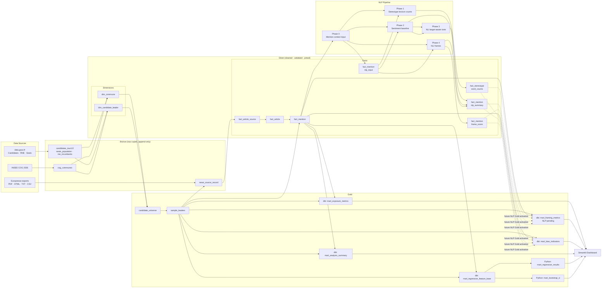
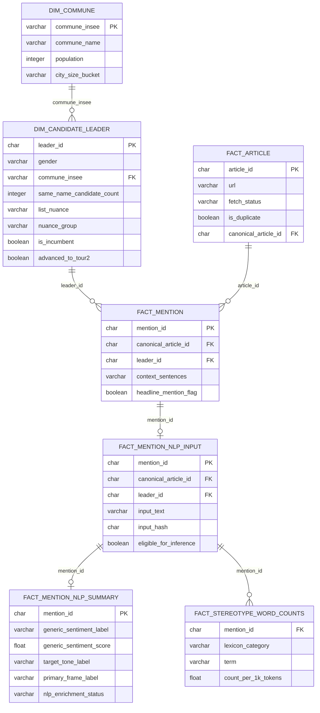

# French Municipal Elections 2026 - Gender Bias in Media Coverage

A data analysis portfolio project examining whether French media coverage of the
2026 municipal elections (*elections municipales*) shows systematic
differences in how male and female candidates are reported on.

---

## Research Questions

- Do French news outlets cover male and female list leaders at different rates during the 2026 municipal election cycle?
- When coverage does exist, does the framing and tone differ by candidate gender?
- Are observed differences associated with factors such as city size, political affiliation, or incumbent status?

---

## Context

France held its municipal elections on **15 and 22 March 2026**. With over
900,000 candidates across more than 50,000 lists, these elections are one of
the largest democratic exercises in the country. Since 2026, all communes -
including those under 1,000 inhabitants - use party-list balloting with strict
gender alternation rules, making this a particularly relevant cycle for
studying gender representation in both politics and media.

This project focuses on **list leaders** (*tetes de liste*) as the unit of
analysis, keeping the scope tractable while capturing the candidates most
likely to receive media attention.

---

## Analysis Scope

| Dimension | Detail |
|---|---|
| Analysis window | 1 November 2025 - 30 April 2026 |
| Candidates | 36 electorally viable list leaders, balanced 50/50 male/female |
| Sampling | Matched stratified cohort: `large=6`, `medium=12`, `small=18`, with a 50/50 gender split inside each stratum, `max 1 candidate per commune`, and a round-1 viability filter |
| Language | French-language sources |
| Geography | Metropolitan France only |

The sample is intentionally small and stratified rather than exhaustive, to
allow for deeper per-candidate analysis while remaining reproducible and
auditable.

---

## Methodology

The analysis cohort is constructed through **matched stratified sampling**
rather than equal allocation across city sizes. The `6 / 12 / 18` quota design
is intentional: it preserves gender balance within each city-size stratum while
reducing the risk that metropolitan candidates dominate the final media corpus.
This matters because large communes are a small share of the municipal map,
women list leaders are scarcer in the largest communes, and larger urban races
are likely to generate more press volume per sampled candidate.

The resulting cohort is therefore designed for **matched comparison**, not for
equal-precision estimation within each stratum. Its goal is to keep gender
comparisons interpretable after controlling for city size, while remaining
auditable through a materialized cohort table and a run-level sample manifest.

The primary cohort is limited to **electorally viable candidates**. A leader is
eligible when they either:

- win at least `10%` of expressed votes in round 1, or
- finish in the top `2` lists within their commune in round 1

That viability filter reflects the study's substantive target: candidates who
were plausibly part of the local media agenda. Within that viable-candidate
frame, the final 36-person cohort is still sampled reproducibly under the
matched `6 / 12 / 18` city-size design.

The current cohort also applies a hard regional concentration cap: no more
than `4` candidates may come from the same region. Region diversity still acts
as an adaptive tie-break inside that cap, so the sample stays geographically
legible without overconcentrating in Île-de-France or any other single region.

---

## Data Sources

All primary data comes from official French public open data, used under their
respective open licences. Sources include:

- **Candidate and list data** - French Interior Ministry (*Ministere de l'Interieur*) via [data.gouv.fr](https://www.data.gouv.fr), covering first-round candidate lists for the 2026 municipal elections. Data may be updated following legal challenges or corrections; version metadata is tracked.
- **Official municipal results** - French Interior Ministry round 1 and round 2 commune-level result exports from [data.gouv.fr](https://www.data.gouv.fr), normalized into one leader x commune x round and used to derive vote-share covariates.
- **Geographic reference data** - INSEE Code Officiel Geographique (COG) 2026, providing commune/departement/region codes and labels used as join keys.
- **Seat and population data** - Interior Ministry dataset on council seat counts and population figures per commune, used for normalising exposure metrics.
- **Incumbent labels** - Interior Ministry RNE (*Repertoire National des Elus*) data on current mayors and councillors, used to flag incumbent candidates.
- **News data** - French-language election coverage exported from Europresse during the analysis window. The ETL uses full text transiently for parsing and candidate matching, but persisted repository artifacts keep only derived features, hashes, lengths, and short previews rather than full article text.

---

## Key Metrics

The analysis is organised around three layers:

1. **Exposure** - article counts, headline mentions, and number of distinct media sources per candidate, normalised by commune population.
2. **Tone and framing** - a generic sentiment baseline, target-aware tone, Silver frame scoring, and tone threshold sensitivity QA are implemented for mention contexts; Gold frame distribution marts remain planned.
3. **Bias indicators** - gender-level comparisons of framing distributions and stereotype-associated vocabulary frequency, with regression models controlling for city size, political bloc, incumbent status, and region.

---

## Ethical and Legal Notes

- All official datasets are published under open licences; sources and version timestamps are recorded.
- News article collection follows the principle of **data minimisation**: full text is used only transiently during the ETL run for matching and metric construction.
- Persisted Parquet and DuckDB artifacts retain only hashes, lengths, and short previews rather than full article text.
- French TDM (text and data mining) rules and CNIL recommendations are respected.

---

## Key Findings

### Data coverage

The corpus covers all 36 cohort candidates with no zero-coverage leaders.
4,023 Europresse source records were ingested; 4 were rejected at the parsing
stage (rejection rate: 0.1%), yielding 3,735 canonical articles and 3,392
candidate mentions.

### Exposure — raw article counts

Male candidates received on average **130 articles** versus **58 articles**
for female candidates (ratio 2.2x) across the analysis window.

This raw gap is largely explained by two confounding factors:

- **Incumbent status.** Incumbent male candidates averaged 475 articles versus
  131 for incumbent female candidates. Incumbents attract disproportionate
  press volume regardless of gender.
- **City size.** The three large-city male candidates averaged 603 articles
  each, driven by one sitting mayor with 1,277 articles — nearly 40% of the
  entire male corpus. Large communes generate higher absolute press volume by
  construction; the sample contains more high-volume male incumbents in that
  stratum.

Within the small-city stratum — where incumbent composition is most balanced —
the raw article counts are nearly equal: male 27.4 articles vs. female 29.8
articles on average.

### Exposure — population-adjusted rate

After dividing by commune population (articles per 10,000 residents), the
direction reverses at the overall level: female candidates average **32.7**
per 10k vs. **27.5** for male candidates. This reversal is itself a
city-size artefact: small-commune candidates produce high per-capita rates by
construction (small denominator), and the small-city stratum is gender-balanced.

The most informative signal at this level comes from the **medium-city
stratum**, where female candidates average 22.1 per 10k versus 9.6 for male
candidates — a 2.3x female advantage that is not explained by incumbent
composition (5F non-incumbent vs. 5M non-incumbent in that stratum).

### Regression — directional audit

A Poisson regression on article count, controlling for city-size bucket,
region fixed effects, political bloc, incumbent status, and election outcome,
produces a `gender_female` coefficient of **+0.229 (SE = 0.078, p = 0.003)**,
corresponding to an incidence rate ratio of approximately **1.26**. Within
this model specification, female candidacy is associated with 26% more
articles than male candidacy after controlling for the listed covariates.

**This result should be read as a directional audit signal, not a causal
claim.** The sample size is n = 36; the Poisson model may underestimate
standard errors due to overdispersion. The dashboard therefore compares Poisson,
Negative Binomial, and bootstrap confidence intervals. Under the more cautious
diagnostics, the direction is positive but uncertain rather than confirmed.

### Sentiment, framing, tone, and lexicon audit

The deterministic stereotype lexicon audit is implemented as Phase 1 of the
NLP enrichment layer. It counts versioned French vocabulary categories from
mention-level context windows only, without persisting full article text.
The v1 lexicon is a minimal seed for structural validation and requires
expansion before statistical interpretation.

The Phase 2 generic sentiment baseline is implemented in
`silver.fact_mention_nlp_summary` using the optional
`cmarkea/distilcamembert-base-sentiment` model. The model card documents
French 1-5 star labels and Amazon Reviews / Allocine training data:
https://huggingface.co/cmarkea/distilcamembert-base-sentiment. This output is
a review-domain baseline diagnostic, not candidate-aware political tone.

Phase 3 target-aware tone is implemented in the same Silver summary table using
the optional `cmarkea/distilcamembert-base-nli` model. It scores mention
contexts against candidate-specific hypotheses built from `gold.sample_leaders`
names and writes `favorable`, `unfavorable`, `neutral`, or `unclassified`.
These outputs remain Silver audit signals until Gold marts and dashboard panels
are explicitly activated.

Phase 4 framing is implemented as Silver model output. It writes full
multi-label frame probabilities to `silver.fact_mention_frame_score` and stores
the selected primary frame in `silver.fact_mention_nlp_summary`.
`unclassified` is only a fallback summary state when no frame passes the
configured threshold; it is not a model-scored frame row.

The tone threshold sensitivity pipeline writes
`data/gold/nlp_tone_sensitivity_report.json` and
`gold.nlp_tone_threshold_sensitivity`. It audits coverage across probability
thresholds by gender without loading Transformer models. It does not
reconstruct alternate label distributions because the Silver summary does not
persist low-confidence raw top labels or full NLI probability vectors.

---

## Limitations

| Limitation | Detail |
|---|---|
| **Single source** | All news data comes from Europresse, a subscription-based press aggregator. It covers major French dailies and regionals but excludes pure-digital outlets, social media, and broadcast transcripts. Coverage is not representative of the full French media ecosystem. |
| **Matched cohort, not national sample** | The 36-candidate cohort is a stratified matched sample designed for controlled gender comparison, not for national-level inference. Findings describe this cohort; they cannot be extrapolated to all French municipal candidates. |
| **Small n** | With n = 36, regression estimates are sensitive to individual high-leverage candidates (notably one large-city incumbent with 1,277 articles). Standard errors may be underestimated under Poisson equidispersion assumptions. |
| **Gold NLP activation not yet implemented** | Deterministic lexicon counts, a generic sentiment baseline, target-aware NLI tone, and Silver NLI frame classification are implemented. NER and Gold NLP marts remain planned, and no dashboard-level tone or framing conclusions should be drawn until Gold NLP marts are activated. |
| **Seed lexicon is intentionally sparse** | The Phase 1 lexicon validates deterministic counting contracts. It must be expanded and reviewed before lexicon rates are used as statistical media-bias evidence. |
| **Observational design** | No causal claims are warranted. Associations between gender and coverage volume may reflect unmeasured confounders not captured by the available covariates. |

---

## Status

> **Runnable end to end for the implemented slice.** The repository now
> implements official-data ingest, the 36-candidate viable-cohort sampler, the
> Europresse-first news corpus ETL, dbt-owned exposure/summary marts, a Python
> regression/bootstrap audit layer, Phase 0 NLP input preparation, Phase 1
> deterministic lexicon counts, Phase 2 generic sentiment baseline, Phase 3
> target-aware tone scoring, Phase 4 Silver frame scoring, tone threshold
> sensitivity QA, and the Streamlit dashboard. Gold NLP activation remains a
> planned extension.

---

## Local Development

Local development commands are standardized on the project virtual environment.
This avoids a common Windows failure mode where `python` resolves to the system
interpreter while the repository dependencies actually live in `.venv`.

Recommended entrypoints:

- **Windows / PowerShell**: `.\scripts\dev.ps1 <command>`
- **macOS / Linux / Git Bash**: `make <target>`

Examples:

```powershell
.\scripts\dev.ps1 lint
.\scripts\dev.ps1 test
.\scripts\dev.ps1 dbt-build
.\scripts\dev.ps1 run-sampling-pipeline
.\scripts\dev.ps1 run-news-corpus-pipeline
.\scripts\dev.ps1 run-nlp-framing-pipeline
.\scripts\dev.ps1 run-nlp-tone-sensitivity-pipeline
```

If PowerShell blocks local scripts, run the same command through:
`powershell -ExecutionPolicy Bypass -File .\scripts\dev.ps1 test`

```bash
make lint
make test
make dbt-build
make run-sampling-pipeline
make run-news-corpus-pipeline
make run-nlp-framing-pipeline
make run-nlp-tone-sensitivity-pipeline
```

Both entrypoints are pinned to the project-local `.venv`, not the system PATH.

The default environment intentionally matches the implemented repository
surface. dbt-duckdb is part of the runnable stack because SQL-friendly Gold
marts are now committed under `dbt/`. Transformer NLP dependencies remain
optional in [`requirements-future.in`](requirements-future.in) for the sentiment
baseline, target-aware tone, and Silver frame scoring.

---

## Pipeline Architecture

This project uses the **medallion architecture** (Bronze -> Silver -> Gold),
the standard pattern in modern data engineering (Databricks, dbt, Snowflake).

| Layer | Purpose | Key Tables |
|---|---|---|
| **Bronze** | Faithful raw copies, append-only | `news_source_record`, `candidates_tour1/2`, `results_tour1/2`, `cog_communes`, `seats_population`, `rne_incumbents` |
| **Silver** | Cleaned, validated, analysis-ready | `dim_commune`, `dim_candidate_leader`, `fact_election_result`, `fact_article_source`, `fact_article`, `fact_mention`, `fact_mention_nlp_input`, `fact_stereotype_word_counts`, `fact_mention_nlp_summary`, `fact_mention_frame_score` |
| **Gold** | Consumer marts + cohort snapshot for dashboard | `candidate_universe`, `sample_leaders`, dbt-owned `mart_exposure_metrics`, `mart_framing_metrics`, `mart_bias_indicators`, `mart_regression_feature_base`, `mart_analysis_summary`, and Python-owned `mart_regression_results`, `mart_bootstrap_ci` |
| **Meta** | Pipeline observability | `meta_run`, `meta_source_snapshot` |

The central fact table is **`fact_mention`** (grain: one article x one
candidate). All NLP outputs - sentiment scores, target-aware tone,
frame classifications, stereotype word counts - are anchored to this grain through the
`fact_mention_nlp_input` contract.

Full logical data model: [`docs/data-model.md`](docs/data-model.md)

### End-to-End Pipeline


```mermaid
flowchart LR
    subgraph SRC["Data Sources"]
        A1["data.gouv.fr<br>Candidates · RNE · Seats"]
        A2["INSEE COG 2026"]
        A3["Europresse exports<br>PDF · HTML · TXT · CSV"]
    end

    subgraph BRZ["Bronze (raw copies, append-only)"]
        B1["candidates_tour1/2<br>seats_population · rne_incumbents"]
        B2["cog_communes"]
        B3["news_source_record"]
    end

    subgraph SLV["Silver (cleaned · validated · joined)"]
        subgraph DIMS["Dimensions"]
            D1["dim_commune"]
            D2["dim_candidate_leader"]
        end
        subgraph FACTS["Facts"]
            F1["fact_article_source"]
            F2["fact_article"]
            F3["fact_mention"]
            F4["fact_mention<br>nlp_input"]
            F5["fact_stereotype<br>word_counts"]
            F6["fact_mention<br>nlp_summary"]
            F7["fact_mention<br>frame_score"]
        end
    end

    subgraph NLP["NLP Pipeline"]
        N0["Phase 0<br>Mention context input"]
        N1["Phase 1<br>Stereotype lexicon counts"]
        N2["Phase 2<br>Sentiment baseline"]
        N3["Phase 3<br>NLI target-aware tone"]
        N4["Phase 4<br>NLI frames"]
        N0 --> N1
        N0 --> N2
        N2 --> N3
        N0 --> N4
    end

    subgraph GLD["Gold"]
        G0["candidate_universe"]
        G1["sample_leaders"]
        G2["dbt: mart_exposure_metrics"]
        G3["dbt: mart_framing_metrics<br>NLP pending"]
        G4["dbt: mart_bias_indicators"]
        G5["dbt: mart_regression_feature_base"]
        G6["dbt: mart_analysis_summary"]
        G7["Python: mart_regression_results"]
        G8["Python: mart_bootstrap_ci"]
    end

    A1 --> B1
    A2 --> B2
    A3 --> B3
    B1 & B2 --> D1 & D2
    D1 & D2 --> G0
    G0 --> G1
    G1 --> B3
    B3 --> F1
    F1 --> F2

    G1 & F2 --> F3
    F3 --> N0 --> F4
    F4 --> N1 --> F5
    F4 --> N2 --> F6
    N2 --> N3 --> F6
    F4 --> N4 --> F7
    N4 --> F6

    G1 & F3 --> G2 & G3 & G4 & G5 & G6
    F5 & F6 & F7 -. "future NLP Gold activation" .-> G3 & G4
    G5 --> G7 & G8
    G2 & G3 & G4 & G6 & G7 & G8 --> DASH["Streamlit Dashboard"]
```

**Implementation note.** The runnable repository currently materializes
`gold.candidate_universe`, `gold.sample_leaders`, the canonical news corpus backbone
(`fact_article_source`, `fact_article`, `fact_mention`), Phase 0 NLP input,
Phase 1 deterministic stereotype counts, Phase 2 generic sentiment baseline,
Phase 3 target-aware tone scoring,
tone threshold sensitivity QA artifacts,
Phase 4 Silver frame scoring,
dbt-owned exposure and summary marts, and Python-owned regression diagnostics.
Gold NLP activation remains a planned extension on top of that implemented
slice.

### Silver Layer - Entity Relationships


```mermaid
erDiagram
    DIM_COMMUNE {
        varchar commune_insee PK
        varchar commune_name
        integer population
        varchar city_size_bucket
    }

    DIM_CANDIDATE_LEADER {
        char    leader_id PK
        varchar gender
        varchar commune_insee FK
        integer same_name_candidate_count
        varchar list_nuance
        varchar nuance_group
        boolean is_incumbent
        boolean advanced_to_tour2
    }

    FACT_ARTICLE {
        char    article_id PK
        varchar url
        varchar fetch_status
        boolean is_duplicate
        char    canonical_article_id FK
    }

    FACT_MENTION {
        char    mention_id PK
        char    canonical_article_id FK
        char    leader_id FK
        varchar context_sentences
        boolean headline_mention_flag
    }

    FACT_MENTION_NLP_INPUT {
        char    mention_id PK
        char    canonical_article_id FK
        char    leader_id FK
        varchar input_text
        char    input_hash
        boolean eligible_for_inference
    }

    FACT_MENTION_NLP_SUMMARY {
        char    mention_id PK
        varchar generic_sentiment_label
        float   generic_sentiment_score
        varchar target_tone_label
        varchar primary_frame_label
        varchar nlp_enrichment_status
    }

    FACT_STEREOTYPE_WORD_COUNTS {
        char    mention_id FK
        varchar lexicon_category
        varchar term
        float   count_per_1k_tokens
    }

    DIM_COMMUNE ||--o{ DIM_CANDIDATE_LEADER : "commune_insee"
    DIM_CANDIDATE_LEADER ||--o{ FACT_MENTION : "leader_id"
    FACT_ARTICLE ||--o{ FACT_MENTION : "article_id"
    FACT_MENTION ||--o| FACT_MENTION_NLP_INPUT : "mention_id"
    FACT_MENTION_NLP_INPUT ||--o| FACT_MENTION_NLP_SUMMARY : "mention_id"
    FACT_MENTION_NLP_INPUT ||--o{ FACT_STEREOTYPE_WORD_COUNTS : "mention_id"
```

---

## Project Structure

```text
election-gender-bias_D4W/
  README.md
  docs/               # Project documentation (data model, architecture)
  data/               # Data files (not committed to git)
  scripts/            # Runnable entry points
  src/                # Source code
  tests/              # Tests
```

---

## Motivation

This project is being developed as a portfolio piece demonstrating end-to-end
data work: from ingesting and modelling structured official data, to
collecting and analysing unstructured text, to producing interpretable
quantitative findings. The 2026 municipal elections provide a timely,
well-defined, and publicly documented empirical setting.
