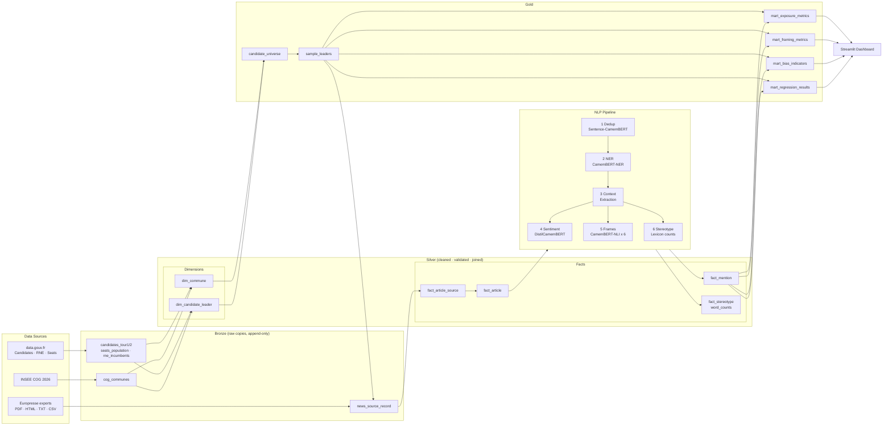
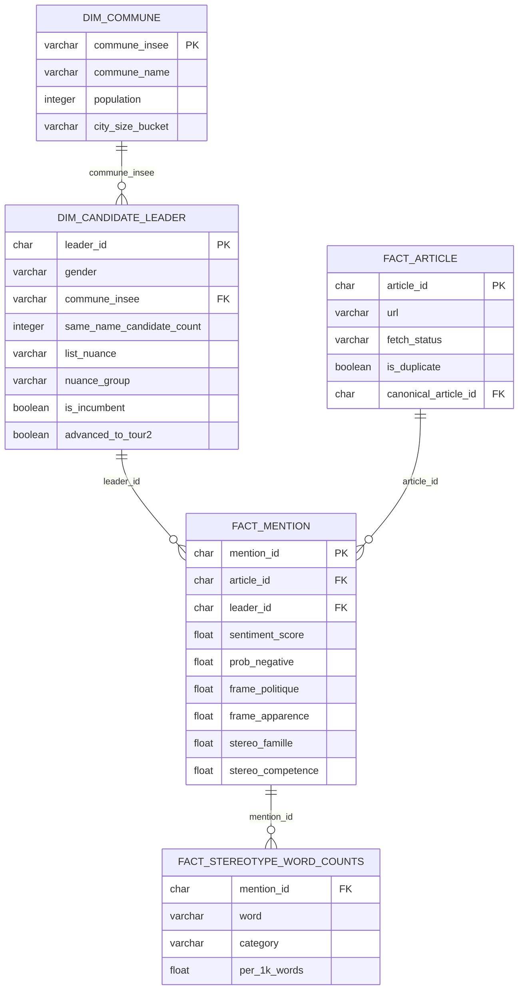

# French Municipal Elections 2026 - Gender Bias in Media Coverage

A data analysis portfolio project examining whether French media coverage of the
2026 municipal elections (*elections municipales*) shows systematic
differences in how male and female candidates are reported on.

---

## Research Questions

- Do French news outlets cover male and female list leaders at different rates during the 2026 municipal election cycle?
- When coverage does exist, does the framing and tone differ by candidate gender?
- Are observed differences associated with factors such as city size, political affiliation, or incumbent status?

---

## Context

France held its municipal elections on **15 and 22 March 2026**. With over
900,000 candidates across more than 50,000 lists, these elections are one of
the largest democratic exercises in the country. Since 2026, all communes -
including those under 1,000 inhabitants - use party-list balloting with strict
gender alternation rules, making this a particularly relevant cycle for
studying gender representation in both politics and media.

This project focuses on **list leaders** (*tetes de liste*) as the unit of
analysis, keeping the scope tractable while capturing the candidates most
likely to receive media attention.

---

## Analysis Scope

| Dimension | Detail |
|---|---|
| Analysis window | 1 November 2025 - 30 April 2026 |
| Candidates | 36 electorally viable list leaders, balanced 50/50 male/female |
| Sampling | Matched stratified cohort: `large=6`, `medium=12`, `small=18`, with a 50/50 gender split inside each stratum, `max 1 candidate per commune`, and a round-1 viability filter |
| Language | French-language sources |
| Geography | Metropolitan France only |

The sample is intentionally small and stratified rather than exhaustive, to
allow for deeper per-candidate analysis while remaining reproducible and
auditable.

---

## Methodology

The analysis cohort is constructed through **matched stratified sampling**
rather than equal allocation across city sizes. The `6 / 12 / 18` quota design
is intentional: it preserves gender balance within each city-size stratum while
reducing the risk that metropolitan candidates dominate the final media corpus.
This matters because large communes are a small share of the municipal map,
women list leaders are scarcer in the largest communes, and larger urban races
are likely to generate more press volume per sampled candidate.

The resulting cohort is therefore designed for **matched comparison**, not for
equal-precision estimation within each stratum. Its goal is to keep gender
comparisons interpretable after controlling for city size, while remaining
auditable through a materialized cohort table and a run-level sample manifest.

The primary cohort is limited to **electorally viable candidates**. A leader is
eligible when they either:

- win at least `10%` of expressed votes in round 1, or
- finish in the top `2` lists within their commune in round 1

That viability filter reflects the study's substantive target: candidates who
were plausibly part of the local media agenda. Within that viable-candidate
frame, the final 36-person cohort is still sampled reproducibly under the
matched `6 / 12 / 18` city-size design.

The current cohort also applies a hard regional concentration cap: no more
than `4` candidates may come from the same region. Region diversity still acts
as an adaptive tie-break inside that cap, so the sample stays geographically
legible without overconcentrating in Île-de-France or any other single region.

---

## Data Sources

All primary data comes from official French public open data, used under their
respective open licences. Sources include:

- **Candidate and list data** - French Interior Ministry (*Ministere de l'Interieur*) via [data.gouv.fr](https://www.data.gouv.fr), covering first-round candidate lists for the 2026 municipal elections. Data may be updated following legal challenges or corrections; version metadata is tracked.
- **Official municipal results** - French Interior Ministry round 1 and round 2 commune-level result exports from [data.gouv.fr](https://www.data.gouv.fr), normalized into one leader x commune x round and used to derive vote-share covariates.
- **Geographic reference data** - INSEE Code Officiel Geographique (COG) 2026, providing commune/departement/region codes and labels used as join keys.
- **Seat and population data** - Interior Ministry dataset on council seat counts and population figures per commune, used for normalising exposure metrics.
- **Incumbent labels** - Interior Ministry RNE (*Repertoire National des Elus*) data on current mayors and councillors, used to flag incumbent candidates.
- **News data** - French-language election coverage exported from Europresse during the analysis window. The ETL uses full text transiently for parsing and candidate matching, but persisted repository artifacts keep only derived features, hashes, lengths, and short previews rather than full article text.

---

## Key Metrics

The analysis is organised around three layers:

1. **Exposure** - article counts, headline mentions, and number of distinct media sources per candidate, normalised by commune population.
2. **Tone and framing** - sentiment signals and topical frame distribution (for example policy/governance vs. appearance/private life) for sentences associated with each candidate.
3. **Bias indicators** - gender-level comparisons of framing distributions and stereotype-associated vocabulary frequency, with regression models controlling for city size, political bloc, incumbent status, and region.

---

## Ethical and Legal Notes

- All official datasets are published under open licences; sources and version timestamps are recorded.
- News article collection follows the principle of **data minimisation**: full text is used only transiently during the ETL run for matching and metric construction.
- Persisted Parquet and DuckDB artifacts retain only hashes, lengths, and short previews rather than full article text.
- French TDM (text and data mining) rules and CNIL recommendations are respected.

---

## Status

> **Runnable end to end for the implemented slice.** The repository now
> implements official-data ingest, the 36-candidate viable-cohort sampler, the
> Europresse-first news corpus ETL, exposure marts, a lightweight regression
> audit layer, and the Streamlit dashboard. The transformer-based NLP
> enrichment stack remains the main planned extension.

---

## Local Development

Local development commands are standardized on the project virtual environment.
This avoids a common Windows failure mode where `python` resolves to the system
interpreter while the repository dependencies actually live in `.venv`.

Recommended entrypoints:

- **Windows / PowerShell**: `.\scripts\dev.ps1 <command>`
- **macOS / Linux / Git Bash**: `make <target>`

Examples:

```powershell
.\scripts\dev.ps1 lint
.\scripts\dev.ps1 test
.\scripts\dev.ps1 run-sampling-pipeline
.\scripts\dev.ps1 run-news-corpus-pipeline
```

If PowerShell blocks local scripts, run the same command through:
`powershell -ExecutionPolicy Bypass -File .\scripts\dev.ps1 test`

```bash
make lint
make test
make run-sampling-pipeline
make run-news-corpus-pipeline
```

Both entrypoints are pinned to the project-local `.venv`, not the system PATH.

The default environment intentionally stays lean and matches the implemented
repository surface. Optional future-only dependencies (transformer NLP and dbt)
are split into [`requirements-future.in`](requirements-future.in) so that local
installs and CI do not pay for features that are not yet committed.

---

## Pipeline Architecture

This project uses the **medallion architecture** (Bronze -> Silver -> Gold),
the standard pattern in modern data engineering (Databricks, dbt, Snowflake).

| Layer | Purpose | Key Tables |
|---|---|---|
| **Bronze** | Faithful raw copies, append-only | `news_source_record`, `candidates_tour1/2`, `results_tour1/2`, `cog_communes`, `seats_population`, `rne_incumbents` |
| **Silver** | Cleaned, validated, analysis-ready | `dim_commune`, `dim_candidate_leader`, `fact_election_result`, `fact_article_source`, `fact_article`, `fact_mention`, `fact_stereotype_word_counts` |
| **Gold** | Consumer marts + cohort snapshot for dashboard | `candidate_universe`, `sample_leaders`, `mart_exposure_metrics`, `mart_framing_metrics`, `mart_bias_indicators`, `mart_regression_results` |
| **Meta** | Pipeline observability | `meta_run`, `meta_source_snapshot` |

The central fact table is **`fact_mention`** (grain: one article x one
candidate). All NLP outputs - sentiment scores, frame classifications,
stereotype word counts - are anchored to this grain.

Full logical data model: [`docs/data-model.md`](docs/data-model.md)

### End-to-End Pipeline


```mermaid
flowchart LR
    subgraph SRC["Data Sources"]
        A1["data.gouv.fr<br>Candidates · RNE · Seats"]
        A2["INSEE COG 2026"]
        A3["Europresse exports<br>PDF · HTML · TXT · CSV"]
    end

    subgraph BRZ["Bronze (raw copies, append-only)"]
        B1["candidates_tour1/2<br>seats_population · rne_incumbents"]
        B2["cog_communes"]
        B3["news_source_record"]
    end

    subgraph SLV["Silver (cleaned · validated · joined)"]
        subgraph DIMS["Dimensions"]
            D1["dim_commune"]
            D2["dim_candidate_leader"]
        end
        subgraph FACTS["Facts"]
            F1["fact_article_source"]
            F2["fact_article"]
            F3["fact_mention"]
            F4["fact_stereotype<br>word_counts"]
        end
    end

    subgraph NLP["NLP Pipeline"]
        N1["1 Dedup<br>Sentence-CamemBERT"]
        N2["2 NER<br>CamemBERT-NER"]
        N3["3 Context<br>Extraction"]
        N4["4 Sentiment<br>DistilCamemBERT"]
        N5["5 Frames<br>CamemBERT-NLI x 6"]
        N6["6 Stereotype<br>Lexicon counts"]
        N1 --> N2 --> N3 --> N4 & N5 & N6
    end

    subgraph GLD["Gold"]
        G0["candidate_universe"]
        G1["sample_leaders"]
        G2["mart_exposure_metrics"]
        G3["mart_framing_metrics"]
        G4["mart_bias_indicators"]
        G5["mart_regression_results"]
    end

    A1 --> B1
    A2 --> B2
    A3 --> B3
    B1 & B2 --> D1 & D2
    D1 & D2 --> G0
    G0 --> G1
    G1 --> B3
    B3 --> F1
    F1 --> F2

    F2 --> NLP
    NLP --> F3 & F4

    G1 & F3 --> G2 & G3 & G4 & G5
    G2 & G3 & G4 & G5 --> DASH["Streamlit Dashboard"]
```

**Implementation note.** The runnable repository currently materializes
`gold.candidate_universe`, `gold.sample_leaders`, the canonical news corpus backbone
(`fact_article_source`, `fact_article`, `fact_mention`), and the exposure / regression audit marts. The transformer
NLP blocks shown above remain planned extensions on top of that implemented
slice.

### Silver Layer - Entity Relationships


```mermaid
erDiagram
    DIM_COMMUNE {
        varchar commune_insee PK
        varchar commune_name
        integer population
        varchar city_size_bucket
    }

    DIM_CANDIDATE_LEADER {
        char    leader_id PK
        varchar gender
        varchar commune_insee FK
        integer same_name_candidate_count
        varchar list_nuance
        varchar nuance_group
        boolean is_incumbent
        boolean advanced_to_tour2
    }

    FACT_ARTICLE {
        char    article_id PK
        varchar url
        varchar fetch_status
        boolean is_duplicate
        char    canonical_article_id FK
    }

    FACT_MENTION {
        char  mention_id PK
        char  article_id FK
        char  leader_id FK
        float sentiment_score
        float prob_negative
        float frame_politique
        float frame_apparence
        float stereo_famille
        float stereo_competence
    }

    FACT_STEREOTYPE_WORD_COUNTS {
        char    mention_id FK
        varchar word
        varchar category
        float   per_1k_words
    }

    DIM_COMMUNE ||--o{ DIM_CANDIDATE_LEADER : "commune_insee"
    DIM_CANDIDATE_LEADER ||--o{ FACT_MENTION : "leader_id"
    FACT_ARTICLE ||--o{ FACT_MENTION : "article_id"
    FACT_MENTION ||--o{ FACT_STEREOTYPE_WORD_COUNTS : "mention_id"
```

---

## Project Structure

```text
election-gender-bias_D4W/
  README.md
  docs/               # Project documentation (data model, architecture)
  data/               # Data files (not committed to git)
  scripts/            # Runnable entry points
  src/                # Source code
  tests/              # Tests
```

---

## Motivation

This project is being developed as a portfolio piece demonstrating end-to-end
data work: from ingesting and modelling structured official data, to
collecting and analysing unstructured text, to producing interpretable
quantitative findings. The 2026 municipal elections provide a timely,
well-defined, and publicly documented empirical setting.
