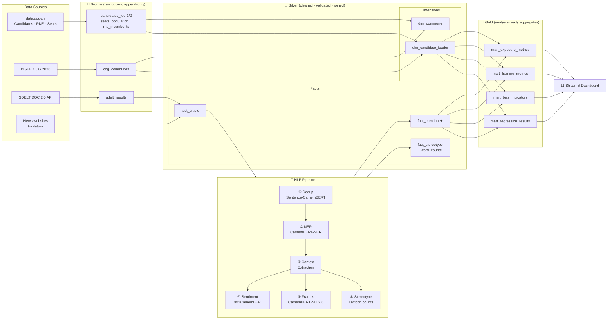
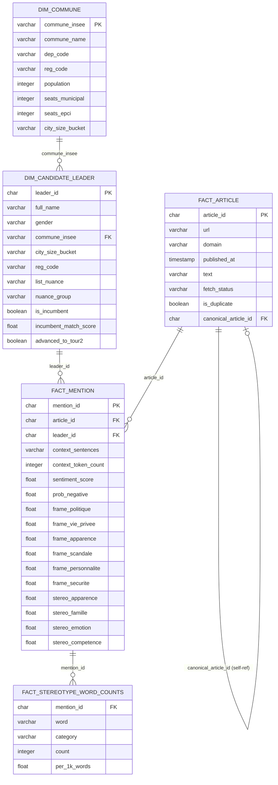

# Pipeline Architecture — Election Gender Bias D4W

> Full logical data model: [`docs/data-model.md`](data-model.md)

---

## End-to-End Data Pipeline

This diagram shows the complete data flow from ingestion through NLP to the
Streamlit dashboard. It answers: *"Can you design a production-grade DE pipeline?"*

---

## Silver Layer — Entity Relationship Diagram

This diagram shows the primary-key / foreign-key relationships between Silver
tables. It answers: *"Do you understand dimensional modelling and fact/dimension
table design?"*

---

## Technology Stack

| Component | Tool | Industry Analogue |
|---|---|---|
| Warehouse | DuckDB (single file) | Snowflake / BigQuery (local) |
| File format | Parquet (Snappy compressed) | Delta Lake / ORC |
| Orchestration | Apache Airflow | Prefect, Dagster |
| SQL transforms | dbt-duckdb | dbt-snowflake, dbt-bigquery |
| French NLP | CamemBERT family (HuggingFace) | BERT (English equivalent) |
| Text extraction | trafilatura | Scrapy, newspaper3k |
| Dashboard | Streamlit | Tableau, Looker |
| CI/CD | GitHub Actions | Jenkins, CircleCI |

