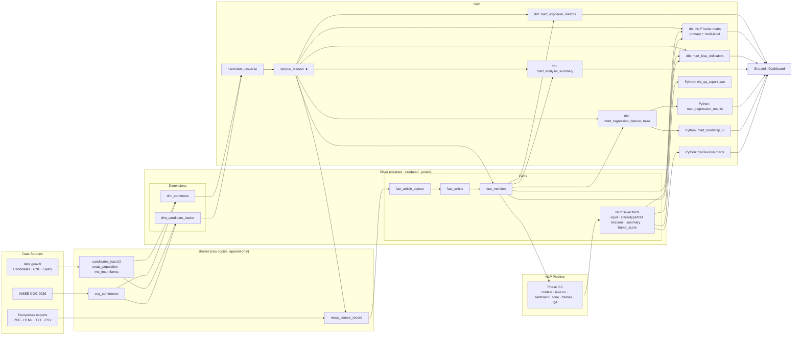
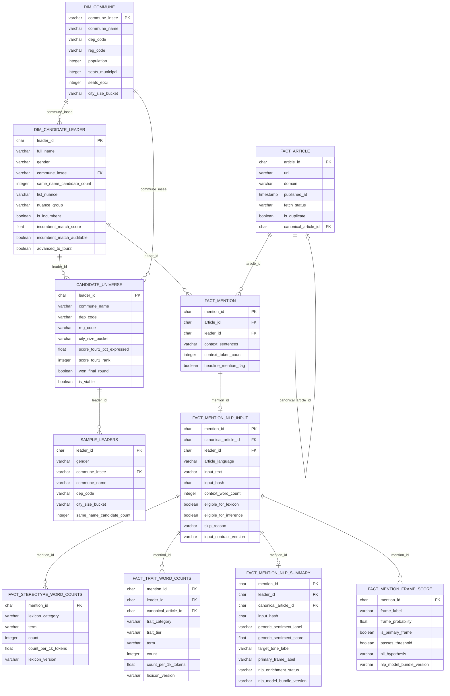

# Pipeline Architecture - Election Gender Bias D4W

> Full logical data model: [`docs/data-model.md`](data-model.md)
> Last updated: 2026-05-27

---

## Architecture Status

Two architectural horizons coexist in this project:

- **Implemented sampling slice**: official-data ingest -> conformed Silver
  dimensions/facts -> `gold.candidate_universe` -> `gold.sample_leaders`
- **Implemented downstream slices (separate entry points)**: sampled cohort ->
  Europresse-first news corpus backbone -> DuckDB -> dbt Gold marts -> Python
  regression/bootstrap diagnostics -> Streamlit dashboard
- **NLP enrichment slices**: Phase 0 input, Phase 1 lexicon audit, Phase 2
  generic sentiment baseline, Phase 3 target-aware tone, Phase 4 Silver frame
  scoring, Phase 5 unified QA reporting, and Phase 6 Gold mart/dashboard
  activation are implemented

This distinction matters for portfolio honesty: the runnable script currently
delivers the implemented audit slice, not the entire future roadmap.

Active news-analysis window for the implemented corpus slice:
`2025-11-01` to `2026-04-30`.

---

## End-to-End Data Pipeline

This diagram shows the full intended data flow from ingestion through NLP to the
Streamlit dashboard while explicitly surfacing the implemented cohort step.

```mermaid
flowchart LR
    subgraph SRC["Data Sources"]
        A1["data.gouv.fr<br>Candidates · RNE · Seats"]
        A2["INSEE COG 2026"]
        A3["Europresse exports<br>PDF · HTML · TXT · CSV"]
    end

    subgraph BRZ["Bronze (raw copies, append-only)"]
        B1["candidates_tour1/2<br>seats_population · rne_incumbents"]
        B2["cog_communes"]
        B3["news_source_record"]
    end

    subgraph SLV["Silver (cleaned · validated · joined)"]
        subgraph DIMS["Dimensions"]
            D1["dim_commune"]
            D2["dim_candidate_leader"]
        end
        subgraph FACTS["Facts"]
            F1["fact_article_source"]
            F2["fact_article"]
            F3["fact_mention"]
            F4["NLP Silver facts<br>input · stereotype/trait lexicons · summary · frame_score"]
        end
    end

    subgraph NLP["NLP Pipeline"]
        N0["Phase 0-5<br>context · lexicon · sentiment · tone · frames · QA"]
    end

    subgraph GLD["Gold"]
        G0["candidate_universe"]
        G1["sample_leaders ★"]
        G2["dbt: mart_exposure_metrics"]
        G3["dbt: NLP frame marts<br>primary + multi-label"]
        G4["dbt: mart_bias_indicators"]
        G5["dbt: mart_regression_feature_base"]
        G6["dbt: mart_analysis_summary"]
        G7["Python: mart_regression_results"]
        G8["Python: mart_bootstrap_ci"]
        G9["Python: nlp_qa_report.json"]
        G10["Python: trait lexicon marts"]
    end

    A1 --> B1
    A2 --> B2
    A3 --> B3

    B1 & B2 --> D1 & D2
    D1 & D2 --> G0
    G0 --> G1
    G1 --> B3
    B3 --> F1
    F1 --> F2
    G1 & F2 --> F3

    F3 --> N0 --> F4

    G1 & F3 --> G2 & G3 & G4 & G5 & G6
    F4 --> G3 & G4 & G9 & G10
    G5 --> G7 & G8
    G2 & G3 & G4 & G6 & G7 & G8 & G10 --> DASH["Streamlit Dashboard"]
```

**Runnable-slice note.** `src/orchestration/sampling_pipeline.py` currently
stops after materializing `gold.candidate_universe` and `gold.sample_leaders`.
`src/orchestration/news_corpus_pipeline.py` then runs the Europresse manifest
through `news_source_record`, `fact_article_source`, `fact_article`,
`fact_mention`, dbt-owned exposure/summary marts, and Python-owned regression
diagnostics. Phase 0 NLP input preparation, Phase 1 deterministic stereotype
and two-tier trait lexicon counts, Phase 2 generic sentiment baseline, Phase 3 target-aware tone, Phase 4
Silver frame scoring, Phase 5 unified QA reporting, and Phase 6 Gold NLP mart
activation are implemented as separate CLI/dbt steps.

---

## Silver Layer - Entity Relationship Diagram

This diagram shows the primary-key / foreign-key relationships between the core
Silver tables and the sampled cohort artifact that depends on them.

```mermaid
erDiagram
    DIM_COMMUNE {
        varchar commune_insee PK
        varchar commune_name
        varchar dep_code
        varchar reg_code
        integer population
        integer seats_municipal
        integer seats_epci
        varchar city_size_bucket
    }

    DIM_CANDIDATE_LEADER {
        char    leader_id PK
        varchar full_name
        varchar gender
        varchar commune_insee FK
        integer same_name_candidate_count
        varchar list_nuance
        varchar nuance_group
        boolean is_incumbent
        float   incumbent_match_score
        boolean incumbent_match_auditable
        boolean advanced_to_tour2
    }

    CANDIDATE_UNIVERSE {
        char    leader_id PK
        varchar commune_name
        varchar dep_code
        varchar reg_code
        varchar city_size_bucket
        float   score_tour1_pct_expressed
        integer score_tour1_rank
        boolean won_final_round
        boolean is_viable
    }

    SAMPLE_LEADERS {
        char    leader_id PK
        varchar gender
        varchar commune_insee FK
        varchar commune_name
        varchar dep_code
        varchar city_size_bucket
        integer same_name_candidate_count
    }

    FACT_ARTICLE {
        char      article_id PK
        varchar   url
        varchar   domain
        timestamp published_at
        varchar   fetch_status
        boolean   is_duplicate
        char      canonical_article_id FK
    }

    FACT_MENTION {
        char    mention_id PK
        char    article_id FK
        char    leader_id FK
        varchar context_sentences
        integer context_token_count
        boolean headline_mention_flag
    }

    FACT_MENTION_NLP_INPUT {
        char    mention_id PK
        char    canonical_article_id FK
        char    leader_id FK
        varchar article_language
        varchar input_text
        char    input_hash
        integer context_word_count
        boolean eligible_for_lexicon
        boolean eligible_for_inference
        varchar skip_reason
        varchar input_contract_version
    }

    FACT_STEREOTYPE_WORD_COUNTS {
        char    mention_id FK
        varchar lexicon_category
        varchar term
        integer count
        float   count_per_1k_tokens
        varchar lexicon_version
    }

    FACT_TRAIT_WORD_COUNTS {
        char    mention_id FK
        char    leader_id FK
        char    canonical_article_id FK
        varchar trait_category
        varchar trait_tier
        varchar term
        integer count
        float   count_per_1k_tokens
        varchar lexicon_version
    }

    FACT_MENTION_NLP_SUMMARY {
        char    mention_id PK
        char    leader_id FK
        char    canonical_article_id FK
        char    input_hash
        varchar generic_sentiment_label
        float   generic_sentiment_score
        varchar target_tone_label
        varchar primary_frame_label
        varchar nlp_enrichment_status
        varchar nlp_model_bundle_version
    }

    FACT_MENTION_FRAME_SCORE {
        char    mention_id FK
        varchar frame_label
        float   frame_probability
        boolean is_primary_frame
        boolean passes_threshold
        varchar nli_hypothesis
        varchar nlp_model_bundle_version
    }

    DIM_COMMUNE ||--o{ DIM_CANDIDATE_LEADER : "commune_insee"
    DIM_CANDIDATE_LEADER ||--o{ CANDIDATE_UNIVERSE : "leader_id"
    DIM_COMMUNE ||--o{ CANDIDATE_UNIVERSE : "commune_insee"
    CANDIDATE_UNIVERSE ||--o{ SAMPLE_LEADERS : "leader_id"
    DIM_CANDIDATE_LEADER ||--o{ FACT_MENTION : "leader_id"
    FACT_ARTICLE ||--o{ FACT_MENTION : "article_id"
    FACT_ARTICLE ||--o| FACT_ARTICLE : "canonical_article_id"
    FACT_MENTION ||--o| FACT_MENTION_NLP_INPUT : "mention_id"
    FACT_MENTION_NLP_INPUT ||--o{ FACT_STEREOTYPE_WORD_COUNTS : "mention_id"
    FACT_MENTION_NLP_INPUT ||--o{ FACT_TRAIT_WORD_COUNTS : "mention_id"
    FACT_MENTION_NLP_INPUT ||--o| FACT_MENTION_NLP_SUMMARY : "mention_id"
    FACT_MENTION_NLP_INPUT ||--o{ FACT_MENTION_FRAME_SCORE : "mention_id"
```

`is_incumbent` is a nullable boolean contract: `TRUE`/`FALSE` when a commune-level
RNE comparison was possible, and `NULL` when no reliable RNE lookup row exists
for that commune. Commune attributes and election-result summary fields are now
joined once in `gold.candidate_universe`, which feeds the cohort viability and
sampling slices.

---

## Technology Stack

| Component | Tool | Industry Analogue |
|---|---|---|
| Warehouse | DuckDB (single file) | Snowflake / BigQuery (local) |
| File format | Parquet (Snappy compressed) | Delta Lake / ORC |
| Orchestration | Scripted runner now; Airflow planned | Prefect, Dagster, Airflow |
| SQL mart layer | dbt-duckdb | dbt-snowflake, dbt-bigquery |
| French NLP | DistilCamemBERT sentiment baseline + CamemBERT NLI tone and framing implemented | BERT-style Transformer enrichment |
| Text extraction | pdfminer.six + BeautifulSoup + trafilatura fallback | Parser stack for archive exports |
| Dashboard | Streamlit | Tableau, Looker |
| CI/CD | GitHub Actions | Jenkins, CircleCI |
